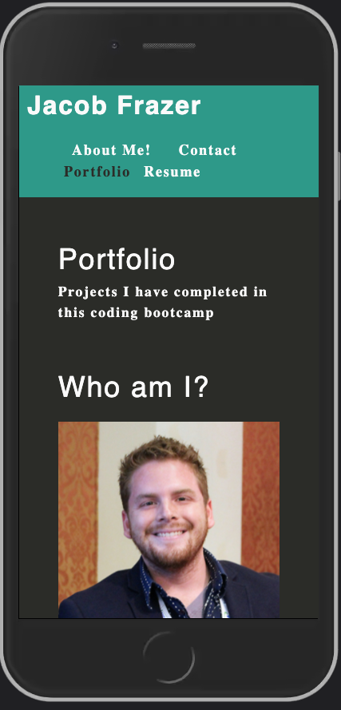

    
# React Developer Portfolio

## License

## Description
    
A Developer Portfolio made using Create React App

## Table of Contents

* [Installation](#installation)
* [Usage](#usage)
* [Credits](#credits)
* [License](#license)
* [Tests](#tests)
* [Questions](#questions)
    
## Screenshot

## Usage

Clone the repo, change directory to react-dev-portfolio from the command-line and run 'npm start' to initialize the development server

## Credits

## Contributing

## Tests
no current test method

## Questions

Please send additional questions to [@coderjake91](https://github.com/coderjake91), email: jacob.b.frazer@gmail.com